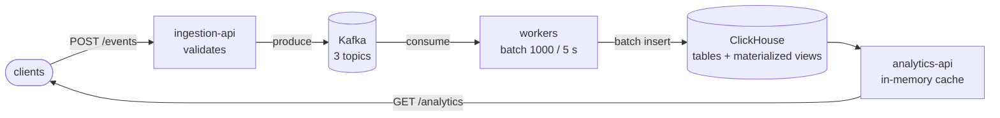

# Real-time analytics pipeline in Rust

[](https://github.com/ragen1337/rust-realtime-analytics/actions/workflows/ci.yml)

[](LICENSE)

An online shop sends events: someone clicked a product, looked at it, bought it. This project takes those events over HTTP, pushes them through Kafka into ClickHouse, and serves analytics on top: top products, a user's activity, conversion, revenue, and live counters.

- **5,000 events/s with p99 under 10 ms**, on a single laptop
- **No lost events.** Kafka offsets are committed only after the ClickHouse insert, and duplicates are collapsed on the ClickHouse side.
- **Zero consumer lag** after a 1.5-million-event stress run, so the write path keeps up, not just the HTTP layer
- **One command** starts the whole stack, with a Grafana dashboard already set up
- **End-to-end tests in CI** against the real stack in Docker


## How it works



**ingestion-api** accepts an event, validates it, and writes it to Kafka. It never touches the database, so a slow ClickHouse doesn't slow down clients.

**workers** read from Kafka and write to ClickHouse in batches of up to 1,000 events, or every 5 seconds, whichever comes first.

**analytics-api** answers read queries from ClickHouse and caches the results in memory for 5 seconds to 10 minutes.

**events-contract** is a small shared crate with the event types. Ingestion and workers can't disagree on the JSON format.

Stack: Rust, actix-web, tokio, rdkafka, clickhouse-rs, moka, Kafka (KRaft), ClickHouse 24.3, Prometheus, Grafana, Docker Compose.

## Why it's built this way

- **Kafka between the API and the database.** Ingestion answers as soon as Kafka has the event. If ClickHouse is slow or down, the events wait in Kafka instead of piling up as errors or timeouts on the client side.
- **Batches, not single inserts.** ClickHouse is built for a few large inserts, not thousands of small ones. With one insert per 1,000 events, a handful of workers keeps up with 5,000 events/s.
- **Commit after write.** A worker commits its Kafka offset only after the batch is in ClickHouse. A crash can therefore cause a duplicate but never a loss. Duplicates share an `event_id`, and ClickHouse's `ReplacingMergeTree` collapses them ([how exactly](docs/data-model.md)).
- **Materialized views for the heavy queries.** Top products over a day or a week, and revenue per product, are updated by ClickHouse on every insert, so reading them doesn't scan raw events.
- **An honest load test.** The load generator is open-loop: it starts requests at a fixed rate even if earlier ones are still running. A slow server shows up as higher latency and can't quietly lower the load.

## Performance

Targets: ingestion at 3,000 req/s or more with p99 under 150 ms; analytics at 5,000 req/s or more with p99 under 100 ms; over 99% success.

| Scenario | RPS | p50 | p99 | Success |
|---|---|---|---|---|
| Ingestion, 1,000 rps for 60 s | 1,000 | 5.2 ms | 8.8 ms | 100% |
| Ingestion, 5,000 rps for 5 min | 4,990 | 4.2 ms | 8.6 ms | 100% |
| Analytics `/top-products`, 5,000 rps for 60 s | 4,981 | 0.64 ms | 1.7 ms | 99.99% |
| Analytics `/realtime-stats`, 5,000 rps for 60 s | 4,924 | 0.46 ms | 7.8 ms | 100% |

Measured on an Apple M5 (10 cores, 24 GB), with Docker given 10 CPUs and 8 GB, and the load generator running on the same machine. `/realtime-stats` has a higher p99 than `/top-products` because its cache expires every 5 seconds, and the request that hits the expiry goes to ClickHouse. Without a rate limit, ingestion peaks at about 6,400 req/s.

<details>
<summary>Run the load tests yourself</summary>

With the stack running:

```bash
cd load-generator
cargo run --release -- --rps 1000 --duration 60                         # ingestion
cargo run --release -- --rps 5000 --duration 300 --concurrency 500      # ingestion, stress
cargo run --release -- --method get --rps 5000 --duration 60 --concurrency 500 \
  --url 'http://localhost:8082/api/v1/analytics/top-products?metric=clicks&period=1h&limit=10'
```

The load generator is not part of the Cargo workspace, which keeps its HTTP client out of the production dependency tree.

</details>

## Try it

You need Docker with Compose.

```bash
cp .env.example .env
docker compose up -d --build     # the first build takes a few minutes
./scripts/demo.sh
```

The demo sends a view, a click and a purchase, shows that an invalid event is rejected, waits for the workers to flush, and reads everything back:

```
Sending events for user 63234f4c-…
  POST view      -> {"status":"ok"}
  POST click     -> {"status":"ok"}
  POST purchase  -> {"status":"ok"}
An invalid event is rejected before it reaches Kafka:
  POST purchase  -> {"error":"invalid event: quantity: must be >= 1"}
Waiting 6s for the workers to flush the batch to ClickHouse...
Reading it back:
  realtime-stats  -> {"clicks":1,"views":1,"purchases":1}
  …
```

Then look around:

| What | Where |
|---|---|
| Grafana dashboard (no login) | http://localhost:3000 |
| Kafka UI: topics, messages, consumer lag | http://localhost:8081 |
| Tabix: SQL console for ClickHouse (`admin` / `secret`) | http://localhost:8083 |
| Prometheus | http://localhost:9090 |

The ingestion API is on port 8080 and analytics on 8082. Every endpoint is described in [docs/api.md](docs/api.md).

## Tests

```bash
cargo test --workspace                                  # unit tests, no infrastructure needed
docker compose up -d && cd load-generator && cargo test -- --ignored   # end-to-end, against the stack
```

The unit tests cover the event JSON format, validation, batching in the workers, and query parameters and caching in the analytics API. The end-to-end tests send an event, wait for it in ClickHouse, and read it back through the analytics API.

CI runs formatting, clippy and unit tests on every push to `main` and on pull requests, plus a separate job that starts the full stack in Docker and runs the end-to-end tests.

## Where it would go next

This runs on one machine, and some shortcuts are deliberate. What I'd change for production:

| Now | In production |
|---|---|
| Single Kafka and ClickHouse nodes | Replicated Kafka and `ReplicatedReplacingMergeTree` on a ClickHouse cluster |
| A malformed Kafka message is logged and skipped | A dead-letter topic to keep it for inspection |
| Materialized views can over-count after a worker crash ([details](docs/data-model.md)) | Exact counts via `FINAL` or deduplication before aggregation, where it matters |
| Tables sorted by user, so time-range queries scan the month's partition | A projection or skip index on `timestamp` once the data grows |
| Cache inside each analytics-api process | A shared cache when there are several replicas |
| No auth or rate limiting on ingestion | Both, at the edge |

## More

- [docs/api.md](docs/api.md): endpoints, validation rules, error format
- [docs/data-model.md](docs/data-model.md): ClickHouse tables, and how duplicates appear and get removed
- [docs/observability.md](docs/observability.md): metrics and the Grafana dashboard

```
events-contract/   shared event types and Kafka topic names
ingestion-api/     HTTP → Kafka
workers/           Kafka → batches → ClickHouse
analytics-api/     ClickHouse → cached JSON API
load-generator/    load tester and end-to-end tests (not part of the workspace)
clickhouse/init/   tables and materialized views
observability/     Prometheus config and Grafana dashboard
scripts/demo.sh    end-to-end demo against the running stack
```
