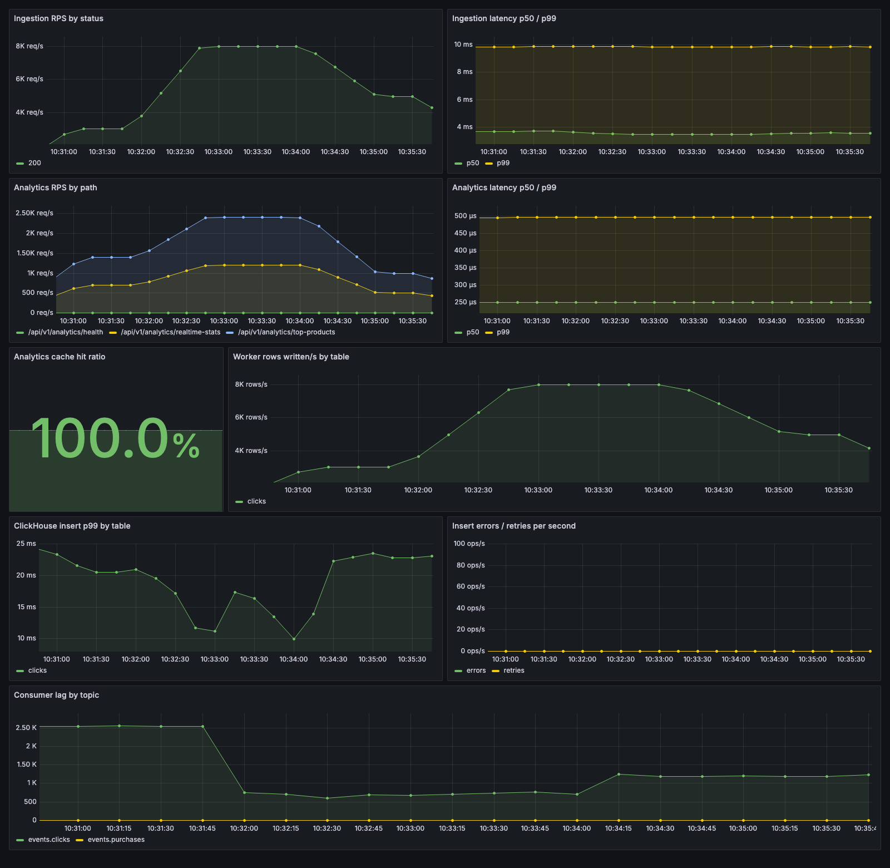

# Metrics and dashboard

Once the stack is running, open Grafana at http://localhost:3000. No login is needed: this is a local demo stack, so anonymous access is turned on. The **Events pipeline** dashboard opens as the home page. Prometheus itself is at http://localhost:9090.

*The dashboard under load: ingestion peaks around 8k requests/s (a 5k stress run overlapping a 3k run), plus about 1.5k requests/s of cached analytics reads.*

## What gets scraped

Prometheus collects every 5 seconds from:

- `ingestion-api` and `analytics-api`, at `GET /metrics`;
- `workers`, on port 9100 (change it with `METRICS_PORT`);
- `kafka-exporter`, which reports how far the workers are behind Kafka (consumer lag).

## Metrics

| Metric | Labels | From |
|---|---|---|
| `http_requests_total` | `method`, `path`, `status` | both APIs |
| `http_request_duration_seconds` (histogram) | `method`, `path` | both APIs |
| `ingestion_kafka_errors_total` | | ingestion-api |
| `analytics_cache_lookups_total`, `analytics_cache_misses_total` | `endpoint` | analytics-api |
| `worker_events_consumed_total` | `topic` | workers |
| `worker_bad_payloads_total` | | workers |
| `worker_batch_rows` (histogram) | `table` | workers |
| `worker_insert_duration_seconds` (histogram, retries included) | `table` | workers |
| `worker_insert_retries_total`, `worker_insert_errors_total` | `table` | workers |
| `kafka_consumergroup_lag` | `consumergroup`, `topic`, `partition` | kafka-exporter |

`path` is the route pattern (for example `/api/v1/analytics/user-activity/{user_id}`), not the actual URL, so user IDs don't turn into thousands of separate time series. The dashboard computes the cache hit ratio as `1 - misses / lookups`.

The config is in `observability/`: the Prometheus scrape config, the Grafana datasource, and the dashboard JSON.
